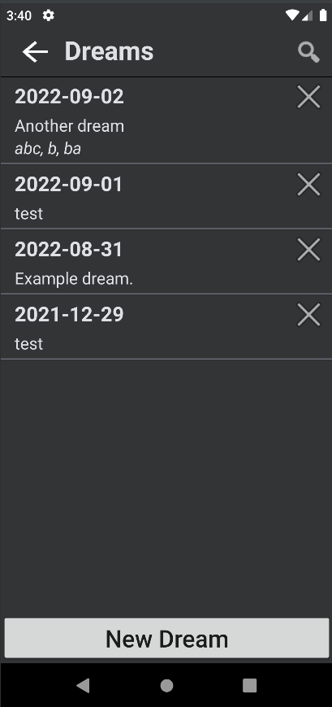
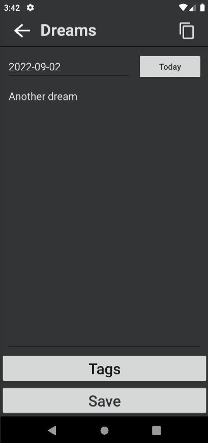
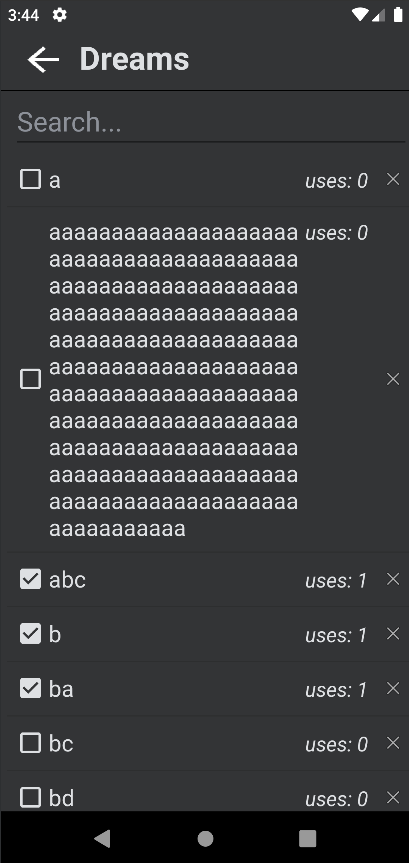
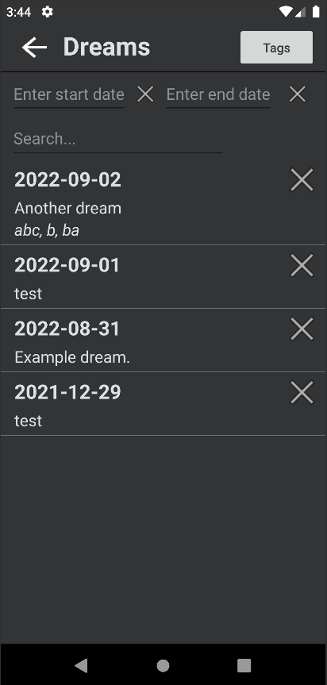
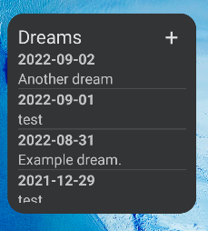

# dreamStoreApp

An android app made so that I can write down any dreams I have, customised to my liking.  
You can create dreams which have a date, description and a list of tags which go with it.  
There is also a home screen widget which is very useful (promise).  

I started to write down my dreams and was using Keep Notes for it, but Keep Notes couldn't provide all the features I wanted. In Keep Notes, you can't search by a combination of labels/tags, only one at a time. Also, as far as I know, the sorting of Keep Notes is unchangeable. It sorts by note creation date descending.  
My solution for this was to make my own app. It can search for dreams by a range of dates (e.g. all dreams from 2022-08-04 to 2022-08-16). Simultaneously it can also search for strings in the description as well as searching by any number of tags. It aslo sorts the dreams differently, sorting by dream date instead of dream note creation date.  

A very important part for me to include in this app was the home screen widget. The Keep Notes widget is very helpful and is the main way I access the app, so I wanted to emulate this for my app. Although I had some issues creating the widget in the first place, I think it turned out very well.  

[apk](./app/release)  

## App Screenshots
### Main Screen
  
### Add New Dream Screen
  
### Edit Dream Screen
  
### Tag Menu
  
### Search Menu
  
### Home Screen Widget
  
On this screen you can add new dreams and edit current ones.  

